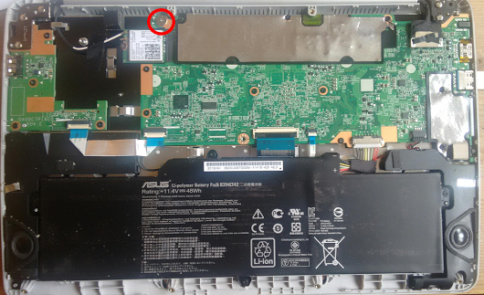
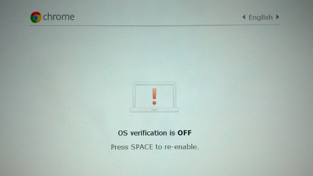
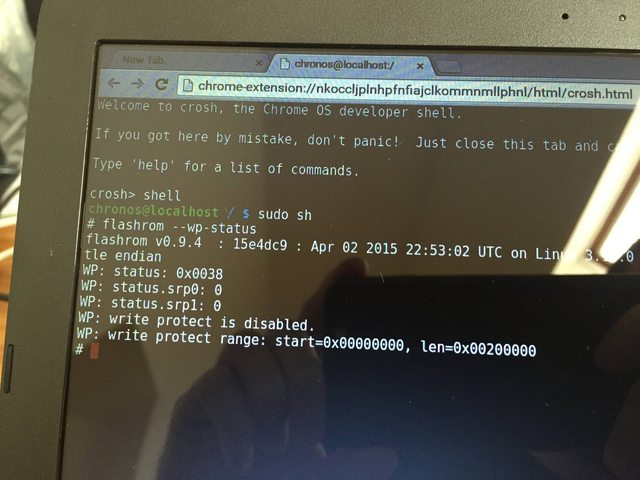

# Asus C200 Chromebook conversion: 

    1. Remove the Bios write protection screw from the motherboard of the laptop. 
        a. Remove 9 screws from bottom of the laptop housing
        b. Pry case open carefully 
        c. Remove big head silver screw (see picture below) then put housing back together

    2. Boot into developer mode 
            i. if having issues booting into developer mode, restore the device to factory settings and try again
        b. Hold esc + refresh + power (will enter recovery mode) 
        c. Press ctrl + d  (turns on developer mode) press enter to continue
        d. System will reboot and show OS verification is OFF

       
        e. Wait until Chromebook boots (will look like normal ChromeOS)
            i. Pressing ctrl + d will skip the wait time
        f. Log in with gmail account (Chromebook requirement)
    3. Check if WPS is disabled
        a. Press ctrl + alt + T (to enter a crosh terminal)
        b. Type: shell
        c. Type: sudo sh
        d. Type: flashrom –wp-status (looking for write protect is disabled)
        e. If write protect is enabled type: flashrom –wp-disable 
            i. then check status to make sure it has changed

    4. Run John Lewis script (while still in Crosh shell)
        a. https://johnlewis.ie/custom-chromebook-firmware/rom-download/
            i. This is the website where this info comes from. 
        b. Run the following in the Crosh shell as one long command
            i. cd; rm -f flash_chromebook_rom.sh; curl -O https://johnlewis.ie/flash_chromebook_rom.sh; sudo -E bash flash_chromebook_rom.sh 
    5. Enable usb boot 
        a. Run the following in the Crosh shell 
            i. sudo crossystem dev_boot_usb=1 dev_boot_legacy=1
    6. Installing Linux
        a. Insert a Linux USB drive
        b. Reboot the Chromebook
        c. Press ctrl-L on boot up (to enter Legacy boot mode)
        d. Press esc to choose boot option
        e. Select USB 
        f. Follow the Linux installer prompts
        g. After it completes remove the USB drive and reboot. 
        h. After install is complete you will need to press ctrl+L at the OS verification OFF screen 
        i. If no USB drive is connected it will automatically boot into the Linux Distro you installed
